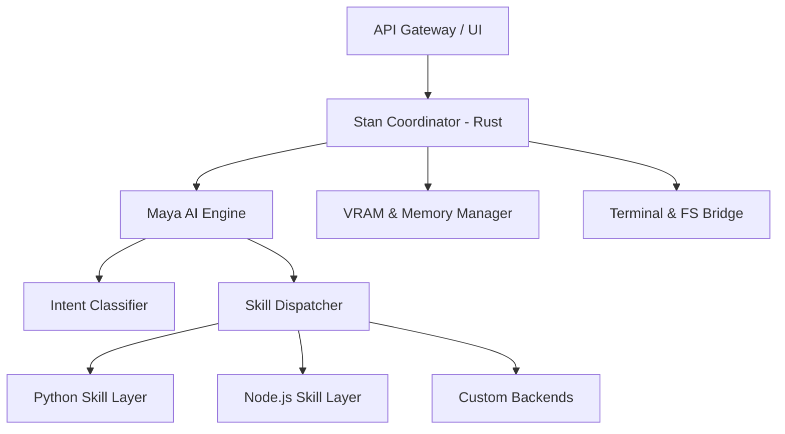

# Stan Studio 🛸

[](https://www.rust-lang.org/)
[](https://reactjs.org/)
[](https://tauri.app/)
[](LICENSE)
[]()
[]()

> **A stateless AI development studio that dynamically morphs into any project environment on demand.**

[Overview](#overview) • [Architecture](#architecture) • [Quick Start](#quick-start) • [Features](#features) • [Roadmap](#roadmap) • [Contributing](#contributing)

---

## Overview

**Stan Studio** is a stateless, AI-native execution environment for modern development. Unlike traditional IDEs that remain static and heavy, Stan Studio maintains no fixed identity. It morphs into a specialized workspace only for the duration of a task — then fully unloads its context, frees system resources, and returns to a blank state ready to become something else entirely.

```
User Project → [ Stan Core ] → Context Injection → Morph → Execute → Unload → Blank
                     ↑                                                          |
                     └──────────────── ready for next session ──────────────────┘
```

The result is a system that can handle any codebase with optimal performance, routing each file and terminal command through a specialized AI agent (Maya) — without keeping unused language servers or heavy runtimes resident in memory.

> **Think of it this way:** Most IDEs are like a library where you have to find the right book. **Stan Studio** is the librarian who instantly becomes the book you need, then forgets it the moment you're done to make room for the next.

## Why Stan Studio?

| Problem | Traditional IDEs | Stan Studio |
| :--- | :--- | :--- |
| **Context Overload** | Indexing thousands of files forever | Loads only what’s relevant for the current task |
| **Resource Usage** | 2GB+ RAM for idle language servers | Near-zero idle cost — blank between sessions |
| **AI Integration** | Chat sidebar or simple autocompletion | AI-Native core (Maya) that controls the terminal/editor |
| **Switching Projects** | Re-indexing, context switching lag | Instant morphing to new project signatures |
| **Stability** | Plugin crashes can take down the IDE | Isolated Rust-governed processes for each skill |

---

## Architecture

Stan Studio is built on a high-performance **Tauri** foundation, leveraging a hybrid strategy:

*   **Rust (The Control Brain):** Handles the file system, process management, security sandbox, and gRPC communication. Memory-safe and blazingly fast.
*   **React + Vite (The Neural Interface):** A premium, glassmorphic UI that provides a low-latency, fluid experience for the developer.



---

## Request Lifecycle

1.  **Idle:** Blank state — 0 CPU/VRAM used by language services.
2.  **Context Injection:** Project folder opened → Maya tags the project type (e.g., Rust, React, Python).
3.  **Morphing:** Coordinator loads relevant "Skills" into the runtime (~200ms - 2s).
4.  **Execution:** AI-augmented editing, terminal commands, and automated code running.
5.  **Session Close:** Unload skills → Flush caches → Return to **Idle**.

---

## Project Structure

```text
stan-studio/
├── src-tauri/                # Rust Control Plane (Tauri)
│   ├── src/
│   │   ├── main.rs           # Entry point
│   │   └── lib.rs            # Core logic
│   └── Cargo.toml
├── src/                      # React Neural Interface (Frontend)
│   ├── components/           # UI Components (Editor, Terminal, Panel)
│   ├── services/             # Maya, FileSystem, Runner, Git
│   ├── hooks/                # Custom React Hooks
│   ├── utils/                # Project & Wallpaper Managers
│   └── App.jsx               # Main Application logic
├── public/                   # Static assets
├── index.html                # UI Root
├── package.json              # Dependencies & Scripts
└── vite.config.js            # Build configuration
```

---

## Quick Start

### Prerequisites

| Dependency | Version | Purpose |
| :--- | :--- | :--- |
| **Rust** | ≥ 1.78 | Control plane |
| **Node.js** | ≥ 20.0 | Frontend & Skill management |
| **Tauri CLI** | ≥ 2.0 | Desktop bundling |

### 1. Clone and Install

```bash
git clone https://github.com/megeezy/stan-studio.git
cd stan-studio

# Install dependencies
npm install
```

### 2. Run in Development

```bash
npm run tauri dev
```

### 3. Build for Production

```bash
npm run tauri build
```

---

## Features

*   🚀 **Stateless Morphing:** Instant adaptation to any project structure.
*   🧠 **Maya AI Integration:** Deeply integrated AI agent capable of executing terminal commands and modifying code.
*   💻 **High-Performance Editor:** Powered by Monaco for a familiar yet enhanced editing experience.
*   🛠️ **Integrated Terminal:** Full Xterm support with split-screen and multi-session capabilities.
*   🛡️ **Rust-Powered Security:** Native file system and process isolation.
*   🎨 **Premium Aesthetics:** Modern, dark-themed UI with fluid animations and glassmorphism.

---

## Roadmap

### Phase 1 — Core Foundation ✅
*   Architecture design and Tauri/Rust integration.
*   FileSystem & Process runner bridge.
*   Integrated Terminal and Monaco Editor.
*   Basic Maya AI (Gemini integration).

### Phase 2 — Dynamic Morphing (In Progress) 🏗️
*   LRU Skill cache for faster morphing.
*   Deep context injection for AI sessions.
*   Multi-window support with shared state.

### Phase 3 — Extension Ecosystem
*   Plugin interface for custom Maya "Skills".
*   Distributed execution (Run code on remote clusters).
*   Collaborative "Live Session" mode.

---

## Contributing

Contributions are what make the open source community such an amazing place to learn, inspire, and create. Any contributions you make are **greatly appreciated**.

1. Fork the Project
2. Create your Feature Branch (`git checkout -b feature/AmazingFeature`)
3. Commit your Changes (`git commit -m 'Add some AmazingFeature'`)
4. Push to the Branch (`git push origin feature/AmazingFeature`)
5. Open a Pull Request

---

## License

Distributed under the MIT License. See `LICENSE` for more information.

---

<p align="center">Built with ⚡ by the Stan Studio Team</p>
