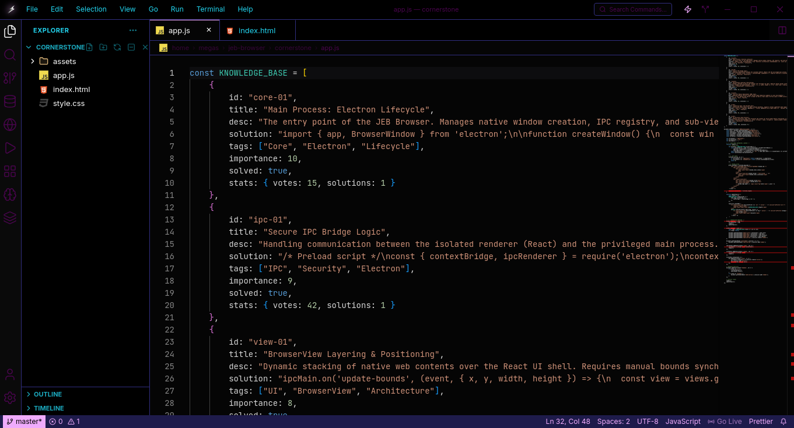
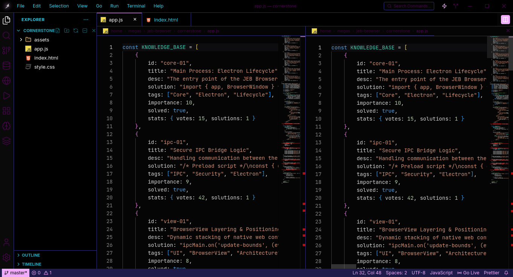
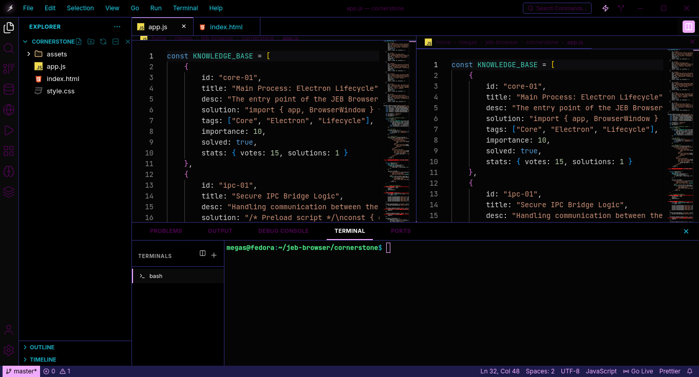
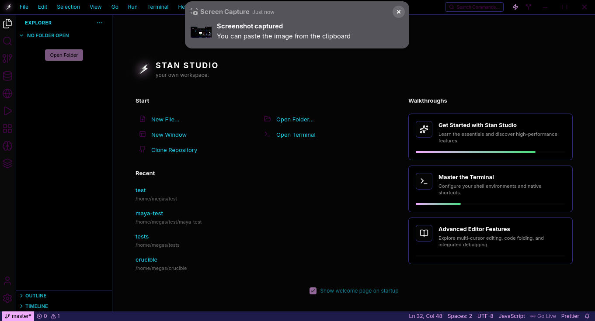
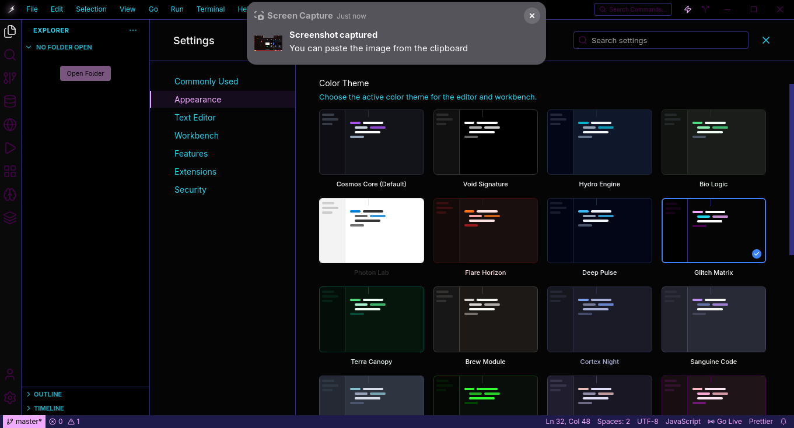
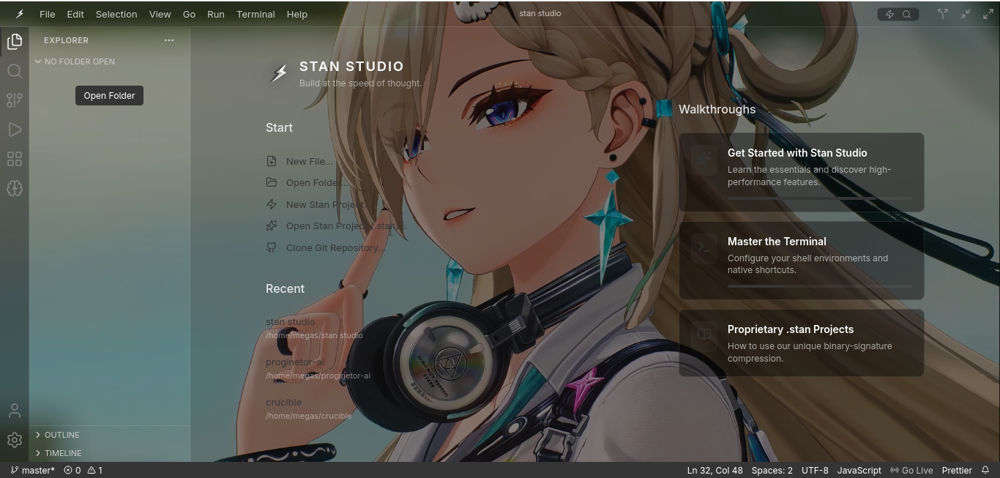

# Stan Studio

<p align="center">
  
  
</p>
<p align="center">
  
  
</p>
<p align="center">
  
  
</p>


**Important: Development Status and Disclaimer**
Stan Studio is currently in a pre-alpha development phase. A significant number of features are incomplete, experimental, or non-functional. Users should expect frequent bugs, performance inconsistencies, and potential instability. 

The Maya Agentic Engine is in an early "beginner" stage and is not yet fully integrated across all IDE subsystems. This software is provided for experimental purposes only and is not recommended for production use at this time.

## Overview
Stan Studio is an industrial-grade, AI-native integrated development environment (IDE) engineered for agentic workflows and local-first software development. It leverages a high-performance hybrid architecture combining a Rust-based control plane with a React-driven user interface to provide a low-latency, secure, and highly extensible workspace.

## Core Components

### 1. Maya Agentic Engine
The Maya Engine is the central intelligence layer of Stan Studio. Unlike traditional autocomplete features or sidebar chat assistants, Maya is an autonomous agent integrated directly into the workspace's operational fabric.
*   **Tool-Use Protocol**: Maya utilizes a structured communication protocol to interact with the host system. It can autonomously create, modify, and delete files, as well as execute complex terminal sequences.
*   **Local Inference Implementation**: By default, the engine interfaces with local Ollama instances (typically Qwen2.5-Coder), ensuring that all source code and intellectual property remain on the host machine.
*   **Context Management**: Maya maintains a dynamic awareness of the active project structure, open files, and terminal state, allowing for high-precision interventions.

### 2. Rust Control Plane (src-tauri)
The backend is built in Rust to ensure memory safety and peak performance. It handles the critical bridge between the web-based UI and the underlying operating system.
*   **Native Bridge**: Facilitates secure file system access and system-level process management through Tauri's IPC mechanism.
*   **Terminal PTY**: Manages the pseudo-terminal sessions, ensuring low-latency character throughput and correct signal handling for the integrated terminal.
*   **Security Sandbox**: Enforces strict permissions on directory access and external process execution.

### 3. Editor Subsystem
The editor is powered by a customized implementation of the Monaco Editor, the same engine that powers VS Code, ensuring a familiar and powerful editing experience.
*   **Symbol Indexing**: An integrated service that scans files for functions, classes, and variables to facilitate rapid navigation and AI context injection.
*   **Multi-File Management**: Support for split-views, multiple tabs, and virtual files for diffing and temporary AI-generated drafts.

### 4. Terminal and Shell Integration
Stan Studio features an integrated Xterm.js terminal that provides a full-fidelity shell experience.
*   **Toolchain Integration**: Seamlessly interfaces with existing compilers, interpreters, and version control systems (Git).
*   **Automated Execution**: The Maya Engine can directly pipe commands into the terminal, allowing for automated testing, building, and deployment cycles.

### 5. Project State and Serialization
The studio introduces the `.stan` project format for workspace persistence and portability.
*   **State Compression**: Projects can be exported as compressed archives containing the codebase, session metadata, and configuration.
*   **Universal File System**: Supports both native local paths and web-based file handling, enabling flexible deployment scenarios.

## Stan Studio vs. VS Code

| Feature | Stan Studio | VS Code |
| :--- | :--- | :--- |
| **AI Integration** | Agentic-first: AI has native tool access to the workspace and terminal. | Extension-based: AI is typically a sidecar (Copilot) with limited workspace control. |
| **Privacy** | Local-first: Designed to run locally via Ollama with zero data leakage. | Cloud-dependent: Most AI features require data transmission to external servers. |
| **Architecture** | Tailored for AI: The entire IDE architecture is built around the agent-editor-terminal loop. | General Purpose: AI is an overlay on a traditional text editing architecture. |
| **Performance** | Lightweight: Specialized Tauri/Rust core focuses on core development efficiency. | Extension Heavy: Can become resource-intensive as the number of plugins grows. |
| **Project Model** | Session-based: Optimized for high-intensity task execution and portability. | Project-based: Optimized for long-term static codebase management. |

## Technical Specification

*   **Foundation**: Tauri Framework (Rust Backend, Web Frontend)
*   **Frontend Logic**: React 19 / Vite
*   **Editor**: Monaco Editor
*   **Terminal**: Xterm.js with WebGL acceleration
*   **Communication**: gRPC / JSON-RPC
*   **AI Backend**: Local Ollama (qwen2.5-coder:3b recommended)

## Installation and Setup

### Prerequisites
*   Node.js (Version 20 or higher)
*   Rust Toolchain (Stable)
*   Ollama (For local AI capabilities)

### Build Instructions
1. Clone the repository:
   ```bash
   git clone https://github.com/megeezy/stan-studio.git
   ```
2. Install dependencies:
   ```bash
   npm install
   ```
3. Launch in development mode:
   ```bash
   npm run tauri dev
   ```
4. Generate a production build:
   ```bash
   npm run tauri build
   ```

## Configuration
Model parameters and environment settings can be adjusted via the integrated Settings panel or by modifying the `localStorage` keys for `MAYA_MODEL`.

## License
Stan Studio is distributed under the MIT License.
